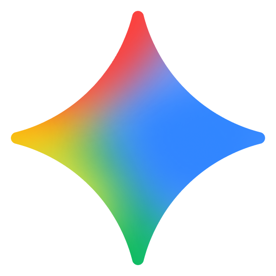

  
  <h1>Gemini Pro Tools</h1>
  
<strong>A powerful browser extension to supercharge your Google Gemini experience.</strong>

  

    <a href="#english">English Documentation</a> | 
    <a href="#persian-فارسی">مستندات فارسی</a>
  

---

<h2 id="english">🇬🇧 English</h2>

**Gemini Pro Tools** is a free, open-source browser extension designed to make interacting with Google Gemini faster, more customizable, and significantly more productive.

### ✨ Features
* **Save & Reuse Prompts**: Built-in library to save your frequently used prompts and insert them with a single click.
* **Export Chat to Markdown**: Download your entire conversation as a beautifully formatted `.md` file.
* **Audio Notifications**: Get a subtle notification sound or an alarm when Gemini finishes generating a long response.
* **Custom Fonts**: Apply any local font (e.g., your favorite coding font) globally across the Gemini UI.
* **Smart RTL Support**: Automatically detects Persian/Arabic text and corrects layout and markdown lists direction (Right-to-Left).
* **Prevent Accidental Closures**: Warns you before closing the tab to prevent losing an active chat.

### 🔒 Privacy First
**All your prompts and chats are stored locally on your browser.** No data is ever sent to external servers or third parties.

### 🚀 Installation
Since this extension is not currently published on the Chrome Web Store, you can install it in Developer Mode:
1. Download this repository as a `.zip` file and extract it, or `git clone` the repo.
2. Open your browser and navigate to `chrome://extensions/`.
3. Enable **Developer mode** (toggle in the top right corner).
4. Click on **Load unpacked** and select the folder you extracted.
5. Open [Google Gemini](https://gemini.google.com/) and enjoy!

### 🧑‍💻 Developer
Designed with 💚 by **Shayan Farhang Pazhooh**
- [GitHub Profile](https://github.com/shayanfp)
- [Personal Website](https://shayanfp.ir)
- [ShayanWeb (Business)](https://shayanweb.com)
- [LinkedIn](https://www.linkedin.com/in/shayanfp)
- [Twitter / X](https://x.com/shayanfpX)
- [Instagram](https://instagram.com/shayanfpinsta)

*Disclaimer: "Gemini Pro Tools" is an unofficial, community-driven browser extension. It is not affiliated with, endorsed by, or associated with Google LLC. The Gemini name and logo are trademarks of Google LLC.*

---

<h2 id="persian-فارسی">🇮🇷 فارسی (Persian)</h2>

افزونه‌ی **Gemini Pro Tools** یک ابزار رایگان و متن‌باز (Open-Source) است که برای حرفه‌ای‌تر کردن و راحت‌تر کردن تجربه‌ی کار با هوش مصنوعی گوگل جمینای طراحی شده.

### ✨ امکانات و قابلیت‌ها
* **کتابخانه پرامپت‌ها**: پرامپت‌های پراستفاده‌ی خودتون رو ذخیره کنید و با یک کلیک اون‌ها رو در چت پیست کنید.
* **خروجی گرفتن از چت (Export)**: کل مکالمه‌ی خودتون با هوش مصنوعی رو به صورت یک فایل تمیز و استاندارد `.md` (Markdown) دانلود کنید.
* **اعلان صوتی (Notification & Alarm)**: وقتی پاسخ دادن جمینای طولانی میشه، می‌تونید از سیستم بخواید وقتی تایپش تموم شد با یک صدای کوتاه (یا زنگ ممتد) به شما خبر بده!
* **فونت دلخواه (Custom Font)**: ظاهر خسته‌کننده‌ی پیش‌فرض رو تغییر بدید و فونت دلخواه خودتون (مثل Vazirmatn یا IRANSans) رو روی کل سایت اعمال کنید.
* **پشتیبانی هوشمند از راست‌چین (RTL)**: تشخیص خودکار متن‌های فارسی و اصلاح جهت‌گیری (Direction) لیست‌ها و جداول.
* **جلوگیری از بسته شدن اشتباهی تب**: اگر دستتون خورد و تب در حال بسته شدن بود، اکستنشن جلوی از بین رفتن چت شما رو می‌گیره.

### 🔒 حریم خصوصی (Privacy)
**تمام پرامپت‌ها و چت‌های شما به صورت کاملاً لوکال (Local) روی مرورگر خودتان ذخیره می‌شود** و هیچ داده‌ای به هیچ سروری ارسال نمی‌گردد.

### 🚀 راهنمای نصب
برای نصب دستی افزونه روی کروم، اج و مرورگرهای مشابه:
1. این ریپازیتوری را دانلود (فایل زیپ) و استخراج کنید.
2. در مرورگر خود به آدرس `chrome://extensions/` بروید.
3. در گوشه بالا-راست، گزینه‌ی **Developer mode** را روشن کنید.
4. روی دکمه‌ی **Load unpacked** کلیک کنید و پوشه‌ی استخراج شده را انتخاب کنید.
5. سایت [گوگل جمینای](https://gemini.google.com/) را باز کنید و از ابزارها لذت ببرید!

### 🧑‍💻 توسعه‌دهنده
طراحی شده با 💚 توسط **شایان فرهنگ پژوه**
- [گیت‌هاب](https://github.com/shayanfp)
- [وب‌سایت شخصی](https://shayanfp.ir)
- [وب‌سایت شایان‌وب](https://shayanweb.com)
- [لینکدین](https://www.linkedin.com/in/shayanfp)
- [توییتر / X](https://x.com/shayanfpX)
- [اینستاگرام](https://instagram.com/shayanfpinsta)

*سلب مسئولیت: افزونه‌ی "Gemini Pro Tools" یک پروژه‌ی غیررسمی و جامعه‌محور است و هیچ‌گونه وابستگی و ارتباطی با شرکت گوگل ندارد. نام و لوگوی Gemini متعلق به شرکت Google LLC است.*

---

  Released under the MIT License

